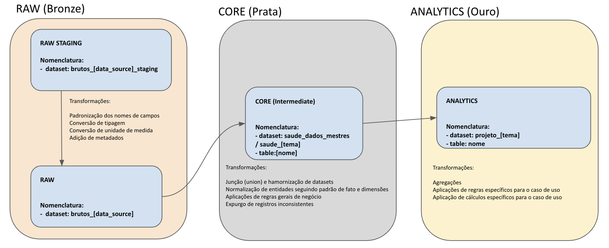

# Organização dos Dados no Data Lake

## **Afinal, onde estão os dados?**

O BigQuery é a ferramenta onde estão guardados nossos dados e que também utilizamos para fazer as consultas SQL. Ele é um serviço de Data Warehouse totalmente gerenciado e altamente escalável oferecido pelo Google Cloud Platform. Ele permite armazenar, consultar e analisar grandes conjuntos de dados de maneira rápida e eficiente.

## **Organização dos dados em Camadas**

Os dados em nosso BigQuery são organizado seguindo o padrão de design de dados conhecido como arquitetura medalhão. Este padrão consiste em organizar logicamente os dados em um Data Lake, com o objetivo de melhorar incremental e progressivamente a estrutura e qualidade dos dados à medida que eles fluem por cada camada da arquitetura (isto é, entre as tabelas da camada Bronze ⇒ Prata ⇒ Ouro):

1. **Bronze ou Dados Brutos**: é onde depositamos todos os dados dos sistemas de origem externos. As estruturas de tabela nesta camada correspondem às estruturas de tabela do sistema de origem "como estão", juntamente com quaisquer colunas de metadados adicionais que capturem a data/hora de carga, o ID do processo, etc.

{ height="200" }

2. **Prata ou Dados Mestres**: nesta camada os dados da camada Bronze são correspondidos, unificados, padronizados e limpos ("o suficiente") para que a camada Prata possa fornecer uma "visão Institucional" de todas as suas principais entidades de saúde, conceitos e transações (por exemplo, pacientes mestres, unidades de saúde mestres, estoque de insumos e medicamentos unificados, registros de vacinação não duplicados,  ...). Ela serve como uma fonte para os desenvolvedores criarem projetos e análises adicionais para resolver problemas na área da saúde.

{ height="200" }

3. **Ouro ou Casos de Uso**: Os dados na camada Ouro geralmente são organizados em bancos de dados "específicos do projeto", prontos para o consumo. A camada Ouro é para relatórios ou dashboards, e utiliza modelos de dados mais desnormalizados (tabelões) e otimizados para leitura, com menos junções (joins).

Dentro do Big Query, estas camadas são facilmente identificados pelos prefixos associados aos conjuntos de tabelas (datasets):

{ height="200" }

## **Visão Geral da Infraestrutura**

O Data Lake da Saúde é composto por várias ferramentas e tecnologias que trabalham juntas para coletar, armazenar, gerenciar e analisar esses dados. Cada componente tem um papel específico e, quando combinados, eles criam um ecossistema poderoso para o tratamento de grandes volumes de informações. Vamos explorar os principais componentes que formam um Data Lake eficiente:

1. **Orquestração com Prefect**: Essencial para garantir que as tarefas sejam executadas de forma ordenada e eficaz. Ele  é a espinha dorsal da automação de fluxos de trabalho, assegurando que os processos de ELT (Extract, Load, Transform) sejam executados de maneira confiável e escalável.

2. **Data Warehouse com BigQuery**: O lugar onde os dados são armazenados de maneira estruturada e prontos para análise. Nele você pode realizar consultas SQL de alta velocidade e armazenar dados transformados para análises mais recorrentes.

3. **Construção e Monitoramento com DBT**: Ferramenta  responsável pela transformação (T do ELT) dos dados dentro do Data Warehouse e pelo monitoramento dos mesmos. Ao trazer o conceito de versionamento de código e testes automatizados ao processo de transformação dos dados, proporciona uma camada adicional de governança e qualidade aos dados no Data Warehouse.

4. **Notificações de Falhas via Discord**: Sistema de alerta que notifica a equipe responsável caso ocorram problemas nos processos de dados. Ele oferece uma comunicação imediata sobre quaisquer interrupções ou falhas, permitindo uma rápida resposta e resolução.

5. **Análise de Dados com Python, R, Power BI e Looker**: Conjunto de ferramentas que permitem aos usuários acessar, analisar e visualizar os dados armazenados no Data Lake.

Cada um desses componentes desempenha um papel vital na construção para que o Data Lake seja robusto e funcional. Juntos, eles oferecem uma infraestrutura completa para que a SMS possa aproveitar ao máximo seus dados

