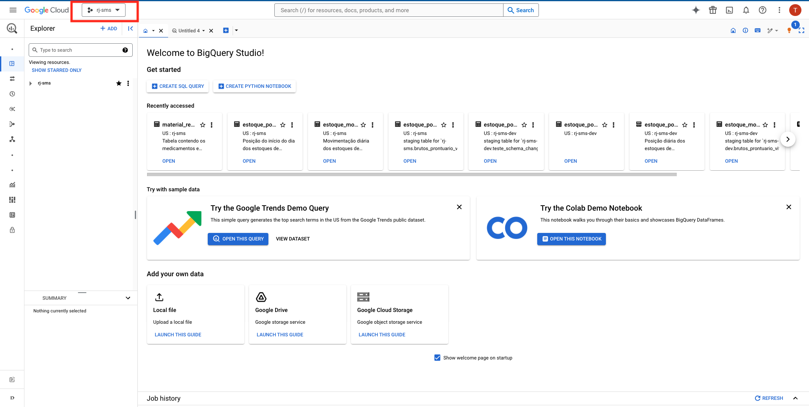
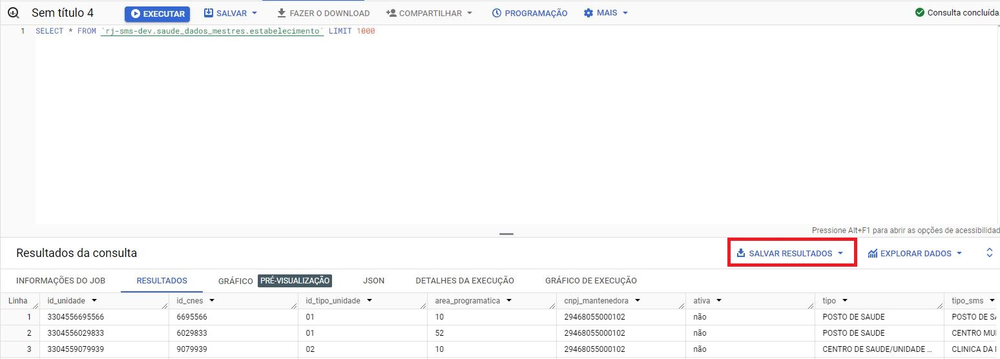
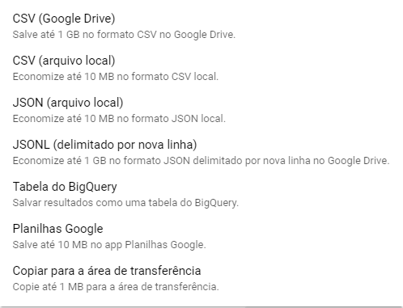

# Consultas diretas no Data Lake

!!! note "Nota"
    O BigQuery é a ferramenta padrão para acessar os dados no Data Lake. Seu meio de acesso é através de uma interface web onde é possível realizar consultas SQL. A partir dele é possível extrair as informações para outros meios comumente utilizados como planilhas, arquivos de texto como csv, ou até para o Google Drive.


## Acessando o BigQuery

Para acessar o ambiente basta acessar este [link](https://console.cloud.google.com/bigquery?project=rj-sms) e acessar com o usuário e senha que foi habilitado quando seu acesso foi solicitado.  Ao acessar o link você verá esta tela:



Neste botão você poderá alternar entre os ambientes de `rj-sms` (Produção) e `rj-sms-sandbox` (Sandbox), confira se esta no ambiente correto antes de iniciar.


A tela inicial do BigQuery Studio oferece um ambiente centralizado para gerenciar e executar consultas e visualizar dados.

### Painel Explorer 

Localizado à esquerda da tela, o painel de Explorer  permite acessar diferentes recursos, como consultas, projetos, conjuntos de dados. Ele oferece uma maneira conveniente de alternar entre as diferentes funcionalidades do BigQuery.

### Barra de Ferramentas

A barra de ferramentas na parte superior da tela fornece acesso rápido a recursos essenciais, como a execução de consultas, a criação de visualizações e o gerenciamento de consultas salvas.

### Guia Consultar

A guia "Consultar" é onde você pode escrever consultas SQL para analisar 
seus dados. Ela oferece recursos avançados de edição, realce de sintaxe e autocompletar, para facilitar a criação de consultas complexas.

### Painel de Visualização

Logo abaixo da guia de consulta, o painel de visualização exibe os resultados das consultas em formato de tabela, facilitando a análise e a interpretação dos dados.

Esses elementos combinados oferecem uma experiência completa para consultar, visualizar e gerenciar dados diretamente no BigQuery Studio, proporcionando um ambiente poderoso para análise e tomada de decisões baseadas em dados. 

## Criando uma Consulta

No Console do BigQuery, clique em "Nova consulta" para abrir o editor de consultas.

Escreva sua consulta SQL no editor. Por exemplo:

!!! info "Observação"
    Incentivamos o uso de consultas que utilizem filtro pelas colunas de partição da tabela. Esta prática reduz o tempo e o custo da consulta.

```{.sql}
SELECT
    *
FROM `seu_projeto.seu_dataset.tabela`
WHERE coluna_particao >= condicao
```



## Executando a Consulta

Depois de escrever sua consulta, clique em "Executar" ou pressione **Ctrl + Enter** para executá-la.
Os resultados da consulta serão exibidos na parte inferior do console.

## Exportando Dados no BigQuery
Com os resultado da consulta em tela, podemos salvar os dados  localmente nos formatos  CSV (Comma-Separated Values) ou JSON (JavaScript Object Notation) . Uma opção também é levar esses dados para o GCS, nos formatos CSV, JSONL, Planilha do Google ou tabela do BigQuery, como no exemplo a seguir.

Usando o botão  ==SALVAR RESULTADOS==  temos as seguintes opções abaixo.

